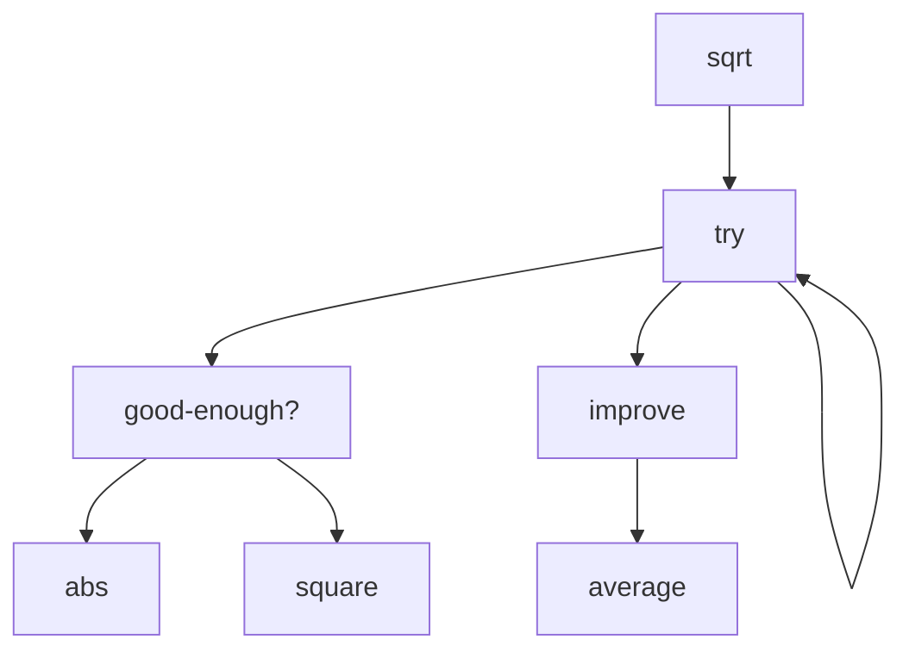

# Lisp 概览

**Tips: 所有的图示的计算过程不是非常严谨**

如何去对计算过程进行形式化的表述？

如何去解决问题？

结合两者发展一套对问题处理过程的精确表述的方法。

讨论一个问题，例如 （3+1）* 2 = 8，这里的 3 和 1，不止是纯数字，有可能是向量，或者电信号，那么如何去设计一个对各种不同类型数据均适用的加法操作。

人为什么能构建大型系统，上百万行的代码是装不进脑袋的。因为能够控制复杂度。那么控制复杂度的方法有什么？

1. black-box  黑盒抽象方法
   + 将处理过程放入盒子里以隐藏细节。这样做的原因是你可以脱身去构建更大的盒子。
2. 控制复杂度的方法 （约定接口）
   + 我们的实现方法是，按照约定来实现相应的接口，并以此将各个部分组合起来。
3. 定义新的语言 （元语言抽象）


看一个求平方根的过程 (用到了递归定义)，亚历山大 Heron 提出的计算平方根的方法

+ make a guess G
  - 给一个猜测值 G
+ improve the guess by averaging G and X/G
  - 通过对 G 和 X/G 求平均值来改善猜测值 G
+ keep improve the guess until it is good enough
  - 持续改善猜测值，知道它足够好

```lisp
; 要写一个求平方跟的过程
; 大致就是对于要求平方根的 x
; 给一个猜测值 guess
; 不断修改 guess，直到正确


; 求绝对值
(define (abs x)
  (if (< x 0) 
         (- x)
      x
  )
)

; 求平均值
(define (average x y) (/ (+ x y) 2))

; 求平方
(define (square x)
  (* x x))


(define (good-enough? guess x)
  (< (abs (- (square guess) x)) 
  .001)
)

(define (improve guess x)
  (average guess (/ x guess))
)

(define (try guess x)
  (if (good-enough? guess x)
  	   guess
  	  (try (improve guess x) x)
  )
)

(define (sqrt x)
  (try 1 x))
```

对上面的代码进行画图解释




对于上面的求平方根的代码的另一种书写方式，把 `improve`、`good-enough?`、`try` 这几个方法放在了 `sqrt` 方法的内部，相当于构建了个求平方根的盒子，定一个了块结构（block structure），隐藏了细节，同时也避免他人定义同名方法造成混乱：

```lisp
; 要写一个求平方跟的过程
; 大致就是对于要求平方根的 x
; 给一个猜测值 guess
; 不断修改 guess，直到正确


; 求绝对值
(define (abs x)
  (if (< x 0) 
         (- x)
      x
  )
)

; 求平均值
(define (average x y) (/ (+ x y) 2))

; 求平方
(define (square x)
  (* x x))


(define (sqrt x)
  (define (improve guess)
    (average guess (/ x guess)))
  (define (good-enough? guess)
    (< (abs (- (square guess) x)) 
      .001))
  (define (try guess)
    (if (good-enough? guess)
       guess
      (try (improve guess))))
  (try 1))
```

Lisp 的基本元素有 `+`、`-`、`*`、`/`，还是有 `23`、`1.738`之类的数据类型。

有 `if`、`cond` 条件语句，`()` 构成组合，`define` 用来抽象，例如给方法、变量命名。
