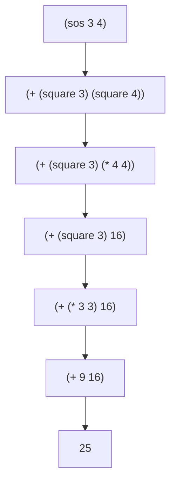
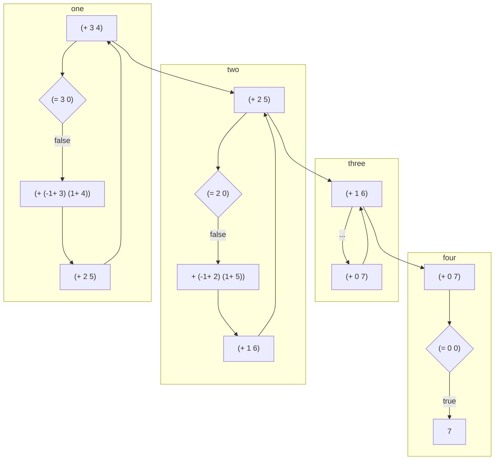
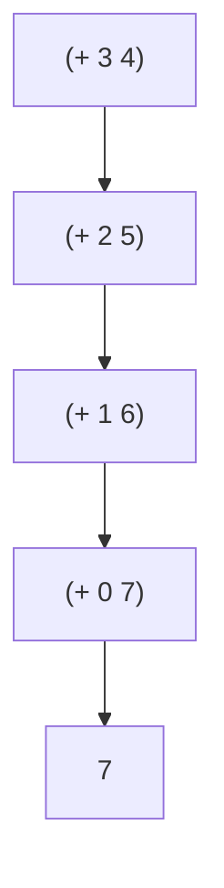
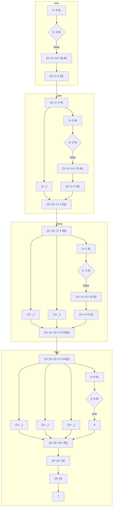
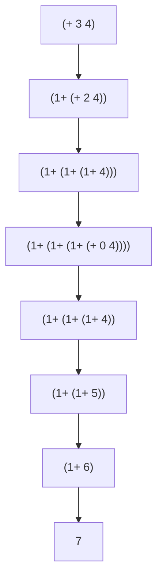
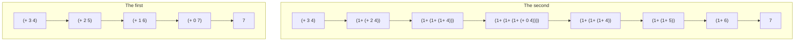
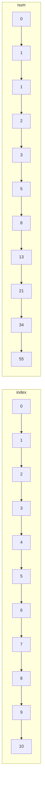
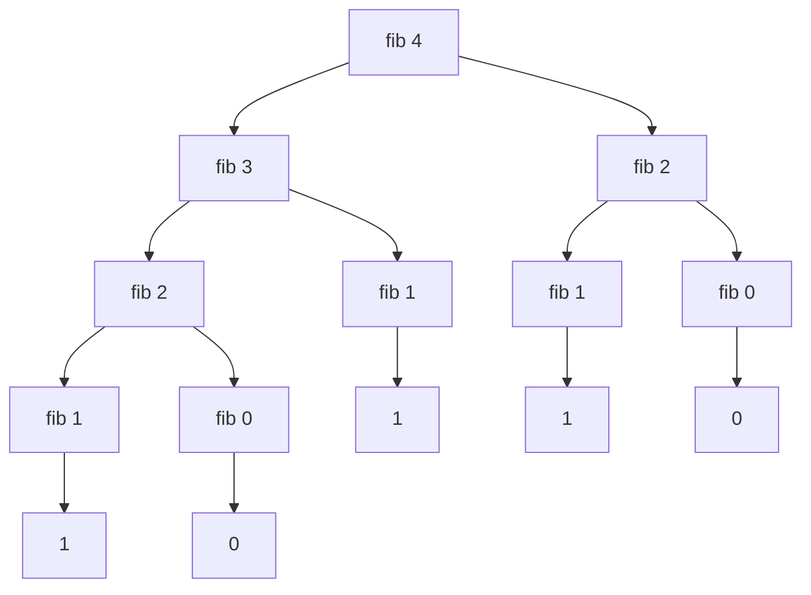

# 计算过程

**Tips: 所有的图示的计算过程不是非常严谨**

学会忽略细节，理解复杂事物的关键是，避免不必要的观察、计算和思考。

```lisp
; 求两个数的平方和

(define (sos x y)
    (+ (square x) (square y)))

(define (square x) (* x x))
```

我们来看下对 (sos 3 4) 的求和过程，过程并不完整，比如忽略了 乘法`*` 等运算符的计算过程。



上面是**应用代换模型**的基本方法。
**Tips：** **代换模型**并不能准确描述计算机实际的运行方式。

## 写一个加法的运算过程：

```lisp
; 这个运算过程相当于，有两堆弹珠 X 和 Y
; 从 X 取一个弹珠，放进 Y 
; 当 X 取到 0 时，那么 Y 就是全部的弹珠

(define (+ x y )
  (if (= x 0)
    y
    (+ (-1+ x) (1+ y))))
```

根据上面的代码描述下 `(+ 3 4)` 的过程 (会省略一些步骤)。



将上面的过程进行简化



## 加法运算过程的另一种写法：

```lisp
(define (+ x y)
  (if (= x 0)
    y
    (1+ (+ (-1+ x) y))))
```

根据上面的代码描述下 `(+ 3 4)` 的过程 (会省略一些步骤)。



将上面的过程进行简化



## 将两种加法运算过程进行对比



上面也就是**迭代**和**递归**的区分。

## 斐波那契数列 (继续探讨计算过程)

一个简单的斐波那契数，例子，如下图。



用代码写出来：

```lisp
(define (fib n)
    (if (< n 2)
        n
        (+ (fib (- n 1))
           (fib (- n 2)))))
```

写出 (fib 4) 的简化的计算过程：



可以看到上面的求斐波那契数列的算法是很糟糕的，例如上图 `fib 2` 被计算了两次。

假设我要求 `fib 5` 的话，那么 `fib 3` 会被重复计算，时间复杂度呈指数增长。