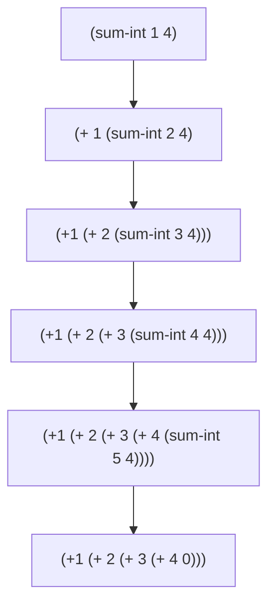
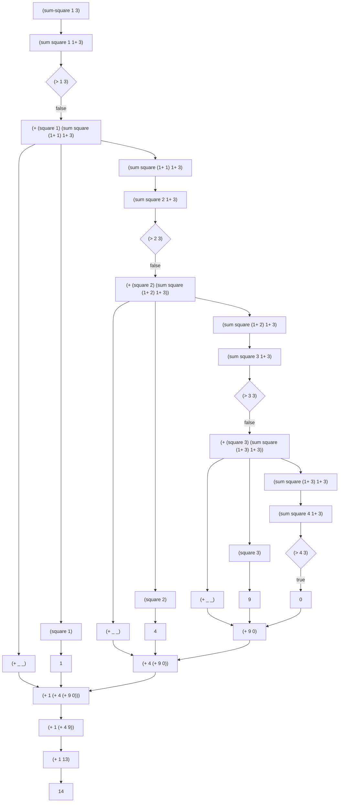

# 高阶过程

**Tips: 所有的图示的计算过程不是非常严谨**

先看一个求和一组整数的求和公式：
$$
\sum_{i=a}^b i
$$
上述公式抽象成 **代码①**：

```lisp
(define (sum-sq a b)
    (if (> a b)
        0
        (+ (square a) (sum-sq (1+ a) b))))
```

简单描述下 (sum-int 1 4) 的计算过程（过程未写完整）：




再看一个数学公式：
$$
\sum_{i=a}^b i^{2}
$$
上述公式抽象成 **代码②**:

```lisp
(define (sum-sq a b)
    (if (> a b)
        0
        (+ （square a) (sum-sq (1+ a) b))))
```

再看一个莱布尼茨公式（省略数学公式书写），用来求 π / 8 的值。
**代码③**:

```lisp
(define (pi-sum a b)
    (if (> a b)
        0
        (+ (/ 1 (* a (+ a 2))) 
            (sum-sq (+ a 4) b))))
```


我们看到 **代码①**、**代码②**、**代码③** 的大部分过程都是相同的，只有一些细微的差别，我们来对此进行抽象 (伪代码)。

```lisp
(define (<name> a b)
    (if (> a b)
        0
        (+ (<term> a)
            (<name> (<next> a) b))))
```

我们将伪代码变成真实的代码：

```lisp
(define (sum term a next b)
    (if (> a b)
        0
        (+  (term a) 
            (sum term (next a) next b)
        )
    )
)
```

我们有四个参数

+ term ：过程
+ a：下界的下标
+ next：获得下一个下标的方法
+ b：上界

这是我们将 **代码①** 重写：

```lisp
(define (sum-int a b)
    (define (indent x) x)
    (define (next y) (+ y 1))
    (sum indent a next b)
)
```

可以看到，函数内部定义了两个计算过程，这两个过程可以进行替换。

我们再将 **代码②** 重写：

```lisp
(define (sum-square a b)
    (define (square x) (* x x))
    (sum square a 1+ b)
)
```

ok 写到这儿我已经忘记计算过程了，那么画图来描述一下 **代码②** 的计算过程 （假设求 (sum-square 1 3) ）：



那么同样的 **代码③** 也可以写出来 (这里省略掉)。